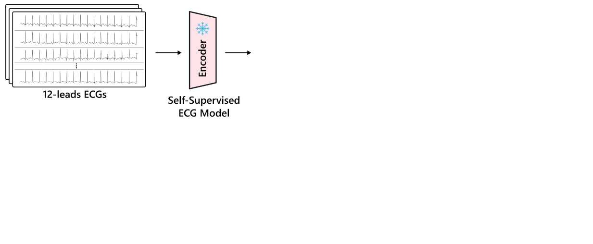

# Electrocardiogram–Language Model for Few-Shot Question Answering with Meta Learning
<div align="center">

<div>
    <a href='https://tang-jia-lu.github.io/' target='_blank'>Jialu Tang</a><sup>1</sup>&emsp;
    <a href='https://xtxiatong.github.io/' target='_blank'>Tong Xia</a><sup>2</sup>&emsp;
    <a href=https://www.tue.nl/en/research/researchers/yuan-lu' target='_blank'>Yuan Lu</a><sup>1</sup>&emsp;
    <a href='https://www.cl.cam.ac.uk/~cm542/' target='_blank'>Cecilia Mascolo</a><sup>2</sup>&emsp;
    <a href='https://aqibsaeed.github.io/' target='_blank'>Aaqib Saeed</a><sup>1</sup>&emsp;
</div>
<div>
<sup>1</sup><a href="https://www.tue.nl/en/our-university/departments/industrial-design/research/our-research-labs/decentralized-artificial-intelligence-research-lab" target="_blank" rel="noopener noreferrer">
                        Decentralized Artificial Intelligence Research Lab, Eindhoven University of Technology, NL
                      </a>&emsp;

<sup>2</sup>Technology at the University of Cambridge, UK;
</div>
</div>


<div align="center">

[](https://arxiv.org/html/2410.14464v1)
[](https://scholar.google.nl/scholar?cluster=4185769924704359587&hl=zh-CN&as_sdt=0,5&as_vis=1)
[](https://tang-jia-lu.github.io/projects/ECG_QA/)
[](https://ieeexplore.ieee.org/document/10888594)

</div>


## 📢 Updates

[10/2024] Arxiv has been released.

[04/2025] Accepted to CHIL 2025

[04/2025] [Code](link) & [Model](link) has been released.


## 📝 Abstract
Electrocardiogram (ECG) interpretation requires specialized expertise, often involving synthesizing insights from ECG signals with complex clinical queries posed in natural language. The scarcity of labeled ECG data coupled with the diverse nature of clinical inquiries presents a significant challenge for developing robust and adaptable ECG diagnostic systems. This work introduces a **novel multimodal meta-learning** method for **few-shot ECG question answering**, addressing the challenge of limited labeled data while leveraging the rich knowledge encoded within **large language models (LLMs)**. Our **LLM-agnostic approach** integrates a pre-trained ECG encoder with a frozen LLM (e.g., LLaMA and Gemma) via a trainable fusion module, enabling the language model to reason about ECG data and generate clinically meaningful answers. Extensive experiments demonstrate superior generalization to unseen diagnostic tasks compared to supervised baselines, achieving notable performance even with limited ECG leads. For instance, in a 5-way 5-shot setting, our method using LLaMA-3.1-8B achieves accuracy of 84.6%, 77.3%, and 69.6% on single verify, choose and query question types, respectively. These results highlight the potential of our method to enhance clinical ECG interpretation by combining signal processing with the nuanced language understanding capabilities of LLMs, particularly in **data-constrained scenarios**.

<div align="left">
<h3>⚓ Overview ⚓</h3>

<h3>📚 Three Pillars of FedNS</h3>
</div>

- **🧩 Task Diversification:** Restructured ECG-QA tasks promote rapid few-shot adaptation.
- **🔗 Fusion Mapping:** A lightweight multimodal mapper bridges ECG and language features.
- **🌐 Model Generalization:** LLM-agnostic design ensures broad transferability and robustness.

## 🔧 Requirements
###  Environment 
1. [torch 2.2.0+cu118](https://github.com/pytorch/pytorch)
2. [torchvision 0.17.0+cu118](https://github.com/pytorch/vision)
3. [numpy 1.21.6](https://github.com/numpy/numpy.git)
3. [flwr 0.6.12](https://github.com/adap/flower)

### Dataset 
We provide the noisy dataset creation on various benchmarks, we shown an example of generating noisy CIFAR10:
- **CIFAR10**:
```
cd ./data/cifar10data
python create_cifar10_noisy.py
```
For benchmark on human annoation errors, you can refer to [CIFAR10/100N](https://github.com/UCSC-REAL/cifar-10-100n). For decentralized data generation, please go to folder [.\src_fed](https://github.com/Decentralized-AI-Reserach-Lab/FedNS/tree/main/src_fed/cifar10).

## 💡 Running scripts

To prepare your experiment, please setup your configuration at the main.py. You can configure the specific federated learning strategy at server.py. You can simply execute the main script them to run the experiment, the results will save as a `logs` file.

```
cd ./scr_fed/cifar10
python main.py
```

## 💭 Correspondence
If you have any questions, please contact me via [email](h.y.li@tue.nl) or open an [issue](https://github.com/Decentralized-AI-Reserach-Lab/FedNS/issues).

## Citing FedNS
The code repository for "[Collaboratively Learning Federated Models from Noisy Decentralized Data](https://arxiv.org/abs/2409.02189)" (IEEE BigData 2024) in PyTorch.  If you use any content of this repo for your work, please cite the following bib entry: 

```bibtex
@inproceedings{li2024collaboratively,
  title={Collaboratively Learning Federated Models from Noisy Decentralized Data},
  author={Li, Haoyuan and Funk, Mathias and G{\"u}rel, Nezihe Merve and Saeed, Aaqib},
  booktitle={2024 IEEE International Conference on Big Data (BigData)},
  pages={7879--7888},
  year={2024},
  organization={IEEE}
}
```
